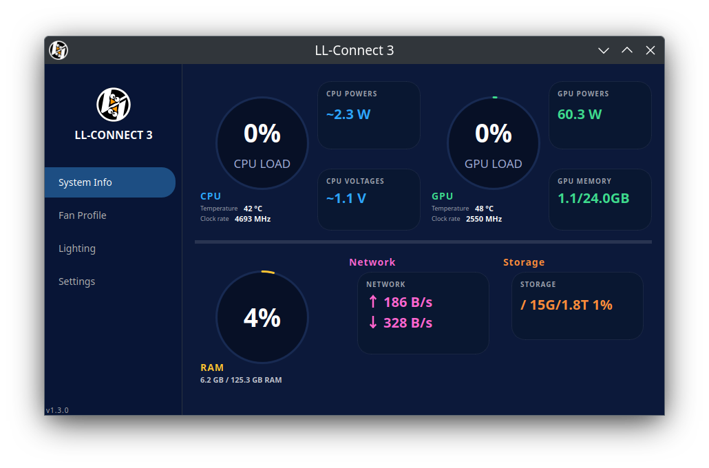
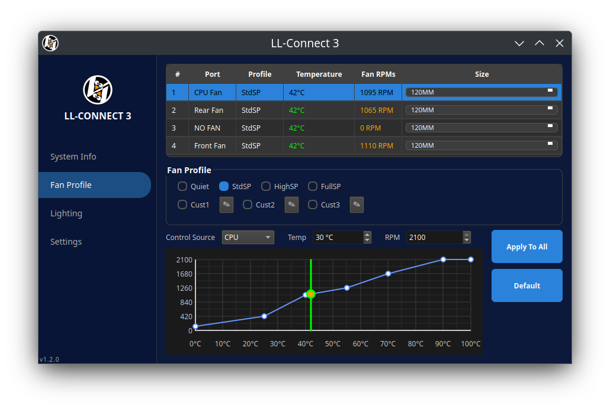
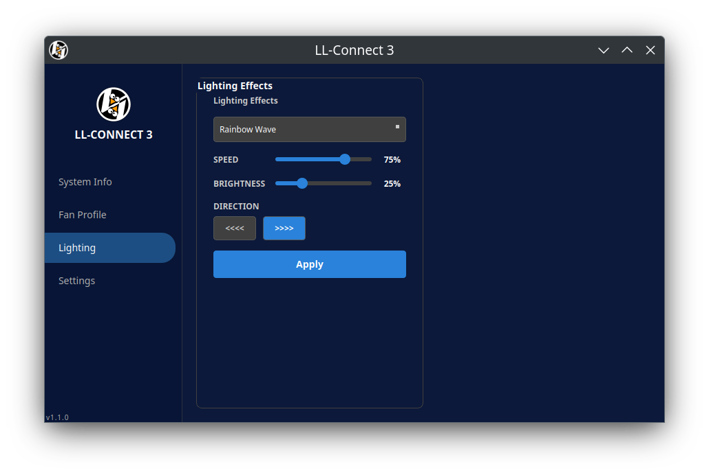
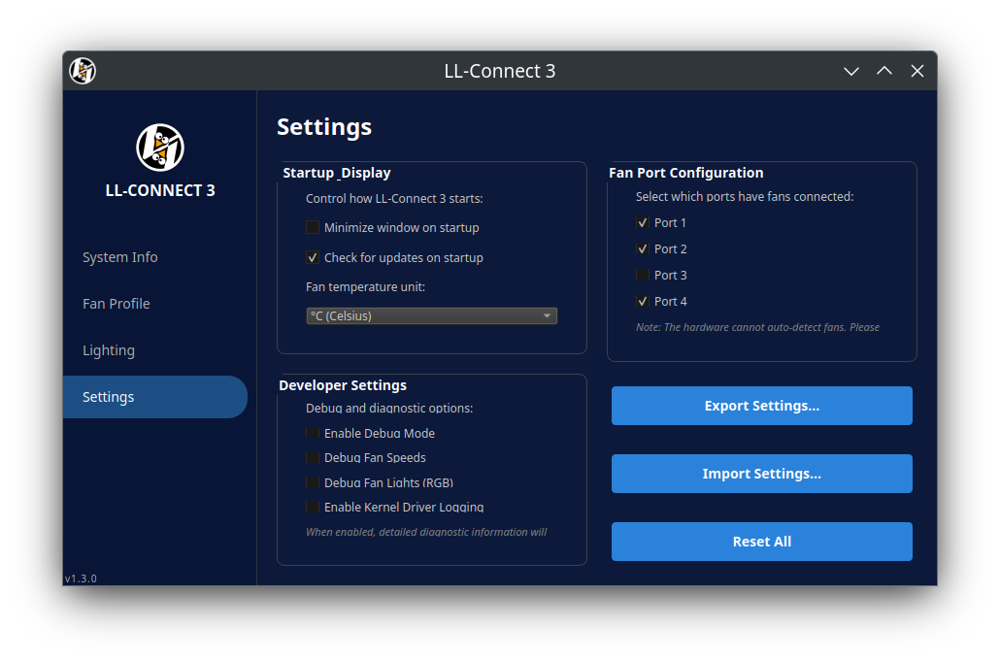

#  LL-Connect 3 — SL-Infinity Hub

Complete Linux support for the Lian Li SL‑Infinity hub: a kernel fan driver and a Qt desktop app that mirrors Windows L‑Connect 3.

#### [1.4.0] - 2026-08-29 — DKMS kernel driver & CI [CHANGELOG Information](CHANGELOG.md)

## Support This Project

If you find this project helpful, please consider supporting its development:

[](https://www.paypal.com/paypalme/joeytroynm)


### Supported Distributions

| Distribution Type | Tested On |
|-------------------|-----------|
| **Debian-based** | Ubuntu, Kubuntu 24.04 LTS, Linux Mint, Pop!_OS |
| **RHEL-based** | Fedora 43, CentOS, Rocky Linux, AlmaLinux |
| **Arch-based** | Arch Linux, Manjaro, EndeavourOS |
| **CachyOS / Clang kernel** | CachyOS (builds with `LLVM=1`) |
| **Immutable (rpm-ostree)** | Bazzite OS |


Your support helps maintain and improve this open-source driver for the Lian Li community!

## Quick Install (Recommended)

Use the provided scripts to install everything (libraries + driver + app) automatically.

> **⚠️ Important:** Before running the installer, make sure your system is fully updated. The kernel driver requires kernel-devel/headers that match your running kernel. On a fresh install, run your system updates first and reboot:
> 
> ```bash
> # Debian/Ubuntu
> sudo apt update && sudo apt upgrade -y && sudo reboot
> 
> # Fedora/RHEL
> sudo dnf upgrade --refresh && sudo reboot
> 
> # Arch
> sudo pacman -Syu && sudo reboot
> ```

```bash
git clone https://github.com/joeytroy/ll-connect3.git
cd ll-connect3
./install.sh
```

The installer will present a menu to select your distribution type:
- **1** Debian-based (Ubuntu, Linux Mint, Pop!_OS, etc.)
- **2** RHEL-based (Fedora, CentOS, Rocky, etc.)
- **3** Arch-based (Arch, Manjaro, EndeavourOS, etc.)
- **4** Bazzite OS (immutable / rpm-ostree)
- **5** CachyOS / Arch with clang kernel (builds with `LLVM=1`)

Choose **4** for Bazzite; the script will use `rpm-ostree` to layer packages and may prompt you to reboot after installing dependencies, then run `./install.sh` again to complete the install.
Choose **5** for CachyOS or any Arch system using a Clang-built kernel; this passes `LLVM=1` during the kernel module build.

After install:
- Run the app: `LLConnect3`
- The installer asks how to install the kernel driver: **DKMS** (recommended — rebuilt automatically on kernel updates) or **Manual** (current kernel only). Bazzite always uses the manual path.
- The kernel module auto‑loads on boot (`Lian_Li_SL_INFINITY`)
- Fan control: `/proc/Lian_li_SL_INFINITY/Port_X/fan_speed` (write 0–100)
- Real RPM readback: `/proc/Lian_li_SL_INFINITY/Port_X/fan_rpm` (read-only, from hub hardware)

Optional GPU monitoring tools (install based on your GPU):

```bash
# NVIDIA (included with proprietary drivers)
nvidia-smi

# AMD
sudo apt install radeontop        # Debian/Ubuntu
sudo dnf install radeontop        # Fedora/RHEL
sudo pacman -S radeontop          # Arch

# Intel
sudo apt install intel-gpu-tools  # Debian/Ubuntu
sudo dnf install intel-gpu-tools  # Fedora/RHEL
sudo pacman -S intel-gpu-tools    # Arch
```

### Uninstall

```bash
cd ll-connect3
./uninstall.sh
```

The uninstall script removes the app, the kernel module (deregistering it from DKMS if it was installed that way), its auto‑load config, and build artifacts.

## Application Overview

- **System Info** — CPU, GPU, RAM, Network and Hard Drive usage at a glance.



- **Fan Profile** — Per‑port custom fan curves with 4 presets (Quiet, Standard, High Speed, Full Speed) and 3 custom slots. Each port can have its own curve driven by CPU or GPU temperature, with specific temp/RPM targets per port. **Click any point on the curve** to select it, then dial the exact temperature/RPM into the editor — no more being stuck editing a single anchor. Ports can be renamed with custom labels. **Real RPM** is read directly from the hub hardware and displayed per port — no more estimated values.



- **Lighting** — Built‑in RGB page with 17 effects: Breathing, Color Cycle, Groove, Meteor, Mixing, Neon, Rainbow Wave, Render, Runway, Spectrum Cycle, Stack, Stack Multi Color, Staggered, Static, Tide, Tunnel, and Voice. Each effect exposes the correct color controls per the hardware protocol — per‑port colors for Static/Breathing, mode‑specific colors (1–4) for pattern effects, and no color controls for auto‑color effects. Speed, brightness, and direction where applicable. Settings persist across restarts.



- **Settings** — Startup behavior (minimize on launch), automatic update checking against GitHub releases, fan port configuration, temperature unit (°C/°F), and developer debug options. **Import / Export** your fan curves, lighting colors, profile names and port labels to a JSON file to back them up or share them between machines. Reset all settings to defaults with one click.



## Development: Manual Build Instructions

If you prefer manual steps or are contributing, follow this section. See [CONTRIBUTING.md](CONTRIBUTING.md) for detailed contribution guidelines, and [kernel/INSTALL.md](kernel/INSTALL.md) for comprehensive kernel driver documentation.

### Prerequisites

- Linux kernel 5.4+
- Build tools and headers: `make`, `gcc`, `linux-headers` (your running kernel)
- Qt 6 (Core, Widgets), CMake 3.16+, `pkg-config`
- Libraries: `lm-sensors`, `libusb-1.0-0-dev`, `libhidapi-dev`

### Kernel Driver (Fan Only)

**DKMS install (recommended):** the module is registered with DKMS and rebuilt automatically whenever a new kernel is installed.

```bash
# Debian/Ubuntu: sudo apt install dkms   |  Fedora: sudo dnf install dkms   |  Arch: sudo pacman -S dkms
cd ll-connect3/kernel
make dkms-install    # copies source to /usr/src, then dkms add/build/install

# Load the module
sudo modprobe Lian_Li_SL_INFINITY

# Auto‑load on boot
echo "Lian_Li_SL_INFINITY" | sudo tee /etc/modules-load.d/lian-li-sl-infinity.conf

# Verify
dkms status | grep lian-li
lsmod | grep Lian_Li
ls -R /proc/Lian_li_SL_INFINITY
```

Remove with `make dkms-uninstall`. On distributions that ship a DKMS signing key (e.g. Ubuntu's `shim-signed` MOK), DKMS signs the module automatically so it loads with Secure Boot enabled.

**Manual install (current kernel only):** builds and installs for the running kernel; you must re-run it after every kernel update.

```bash
cd ll-connect3/kernel
make
make install    # copies .ko into /lib/modules/$(uname -r)/extra and runs depmod

sudo rmmod Lian_Li_SL_INFINITY 2>/dev/null || true
sudo modprobe Lian_Li_SL_INFINITY
echo "Lian_Li_SL_INFINITY" | sudo tee /etc/modules-load.d/lian-li-sl-infinity.conf
```

Notes:
- Write 0–100 to `/proc/Lian_li_SL_INFINITY/Port_X/fan_speed` to set per‑port speed.
- Read actual RPM from `/proc/Lian_li_SL_INFINITY/Port_X/fan_rpm` (queried from hub hardware).
- Use the app for persistent fan presence configuration.

### Qt Application

```bash
cd ll-connect3
mkdir -p build && cd build
cmake -DCMAKE_INSTALL_PREFIX=/usr ..
make -j$(nproc)
sudo make install

# Run the app
LLConnect3

# To uninstall the application
sudo make uninstall
```

### Testing

After building/installing manually, use these quick checks:

```bash
# Verify driver is loaded and proc entries exist
lsmod | grep Lian_Li
ls -R /proc/Lian_li_SL_INFINITY

# Per‑port fan speed test (0–100)
echo 100 | sudo tee /proc/Lian_li_SL_INFINITY/Port_1/fan_speed
echo  50 | sudo tee /proc/Lian_li_SL_INFINITY/Port_2/fan_speed

# Read back commanded speed (0–100)
cat /proc/Lian_li_SL_INFINITY/Port_1/fan_speed
cat /proc/Lian_li_SL_INFINITY/Port_2/fan_speed

# Read real RPM from hub hardware
cat /proc/Lian_li_SL_INFINITY/Port_1/fan_rpm
cat /proc/Lian_li_SL_INFINITY/Port_2/fan_rpm

# Kernel logs (helpful for debugging)
sudo dmesg | grep -i "sli" | tail -20
```

Troubleshooting tips:
- Make sure kernel headers/devel for your running kernel are installed.
- If you rebuilt the module, `sudo rmmod Lian_Li_SL_INFINITY && sudo modprobe Lian_Li_SL_INFINITY`.
- After kernel updates: with DKMS nothing to do — check `dkms status`. With a manual install, rebuild: `cd kernel && make clean && make && sudo make install`.


## Troubleshooting (Basics)

### Secure Boot Compatibility

**IMPORTANT:** With a manual `make install` the module is unsigned and will not load with Secure Boot enabled. The DKMS install signs it automatically where the distro provides a MOK key (Ubuntu/Debian `shim-signed`); otherwise use one of the options below.

To check if Secure Boot is enabled:
```bash
mokutil --sb-state
```

If Secure Boot is enabled, you have two options:

**Option 1: Disable Secure Boot (Recommended for ease)**
1. Reboot and enter your BIOS/UEFI settings (usually F2, F10, F12, or Del during boot)
2. Find the Secure Boot option (usually under Security or Boot settings)
3. Disable Secure Boot
4. Save and exit

**Option 2: Sign the kernel module (Advanced)**
```bash
# Generate signing keys (one-time setup)
sudo /usr/src/linux-headers-$(uname -r)/scripts/sign-file sha256 \
    /path/to/private/key.priv /path/to/public/key.der \
    kernel/Lian_Li_SL_INFINITY.ko

# Then enroll the key with MOK (Machine Owner Key)
sudo mokutil --import /path/to/public/key.der
```

For more details on module signing, see the [kernel documentation](https://www.kernel.org/doc/html/latest/admin-guide/module-signing.html).

### Common Issues

```bash
# Detect device
lsusb | grep -i lian

# Kernel logs
sudo dmesg | grep -i "sli" | tail -20

# Missing headers / kernel-devel mismatch
# Debian/Ubuntu:
sudo apt install linux-headers-$(uname -r)

# Fedora/RHEL:
sudo dnf install kernel-devel-$(uname -r)
# If the exact version isn't available, update and reboot:
sudo dnf upgrade --refresh && sudo reboot

# Arch:
sudo pacman -S linux-headers

# Check if Secure Boot is blocking the module
sudo dmesg | grep -i "lockdown\|secure"
```

### Kernel Version Mismatch

If you see an error like "Kernel build directory not found", it means your kernel-devel/headers don't match your running kernel. This commonly happens on fresh installs. Solution:

1. Run a full system update (see commands above)
2. Reboot into the new kernel
3. Run the installer again

### Bazzite OS / Immutable Systems

**Using the correct installer:**
- Run `./install.sh` and choose option **4** (Bazzite OS). DKMS is not available on immutable systems (`/lib/modules` is read-only), so the driver is always installed manually to `/usr/local/lib/modules/`.

**After system updates:**
- When Bazzite updates the kernel via rpm-ostree, you'll need to rebuild the kernel module (DKMS cannot do this for you on Bazzite):
  ```bash
  cd ll-connect3/kernel
  make clean
  make
  sudo make install
  sudo modprobe -r Lian_Li_SL_INFINITY
  sudo modprobe Lian_Li_SL_INFINITY
  ```

**Package layering:**
- Dependencies are installed using `rpm-ostree install` which requires a reboot
- The installer will prompt you to reboot after layering packages
- After rebooting, run the installer again to continue with the installation

## Protocol Documentation

For detailed information about the fan control protocol, including USB HID commands and reverse-engineering process:

- [Lian Li SL-INFINITY Protocol Documentation](docs/protocol/Lian_Li_SL_INFINITY-protocol.md)

## Supported Device

- Lian Li SL‑Infinity Hub (VID: 0x0CF2, PID: 0xA102)

## License

GPL v2 — see `LICENSE`.

---

### Overview
LL-Connect3 is a fully self-contained, open-source fan and RGB controller for the Lian Li SL-Infinity Hub and compatible fans.  
It includes integrated RGB control logic adapted from the OpenRGB project — you do **not** need to install OpenRGB separately.

### Credits
- Portions of the RGB control code are derived from the [OpenRGB](https://openrgb.org/) project and are used under the terms of the GNU General Public License (GPL).  
- The majority of the implementation was authored with assistance from Cursor AI, while I focused on debugging, testing, and reverse-engineering the hardware protocols.  
- All modifications and integration work are © 2025 Joey Troy and released under the same license.
